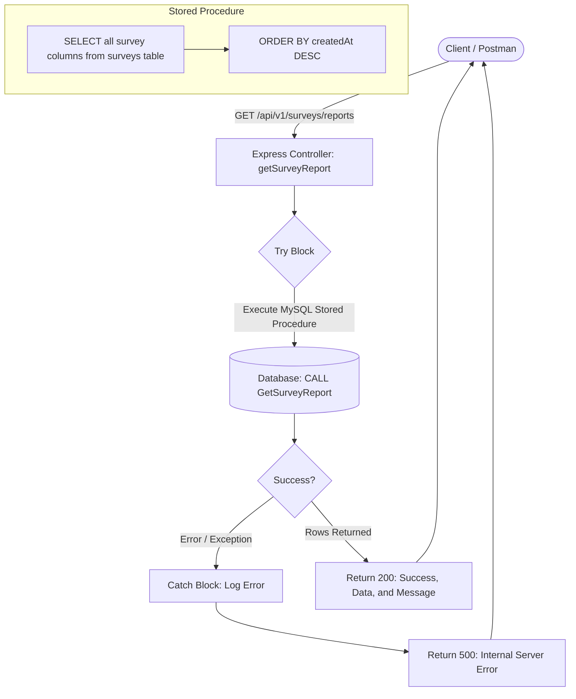

## Getting Started

### Prerequisites

- Node.js: v20.19.0+ or v22.12.0+ (Vite requires these modern versions to run smoothly).
- npm: v10+ (comes packaged automatically with modern Node.js versions).

**The version I used** : _Node.js (v22.23.1)_ and npm (v10.9.8)

### Project Setup & Run Instructions

```bash
1
# Clone repository
https://github.com/kaungMinn/Survey-Backend.git

2
# Navigate to project directory
cd Survey-Backend

3
# Create .env file by using .env.example as a reference

4
# Install dependencies
npm install

5
# Database push
npx drizzle-kit push

6
# Start development server
npm run dev
```

### Create Store Procedure In DB
```JSON
USE table-you-created;


DELIMITER //

CREATE PROCEDURE GetSurveyReport()
BEGIN
    SELECT 
        id, 
        name, 
        phone_number, 
        company_name, 
        designation, 
        token, 
        createdAt 
    FROM surveys
    ORDER BY createdAt DESC;
END //

DELIMITER ;
```

### Project Structure

```
src/
├── drizzle                     # Migrations
├──-src/                        
│    ├── controllers/           # Controller methods
│    └── cors                   # Cross allow origins
|    └── db                     # Drizzle ORM
|    └── zod                    # Validations
|    └── index                  # Backend server  
```

### Flow Diagram With Stored Procedure




# API Endpoints Documentation

Base URL: `http://localhost:3000/api/v1`

---

### 1. Create a Survey Response
* **URL:** `/surveys`
* **Method:** `POST`
* **Description:** Validates incoming payload, checks for token collisions, inserts a new survey record into the database, and returns the newly created record.

#### Request Headers
| Header | Type | Description |
| :--- | :--- | :--- |
| `Content-Type` | String | Must be `application/json` |

#### Request Body (`application/json`)
| Field | Type | Required | Description |
| :--- | :--- | :--- | :--- |
| `name` | String | Yes | Name of the respondent |
| `phone_number` | String | Yes | Contact phone number |
| `company_name` | String | Yes | Name of the company |
| `designation` | String | Yes | Job title or designation |

#### Example Request Body
```json
{
  "name": "Alex",
  "phone_number": "09123456789",
  "company_name": "Tech Corp",
  "designation": "Software Engineer"
}
```

### 2. Get Survey Reports
#### You need to create Store Procedure first !! Please check the above !!
* **URL:** `/surveys/reports`
* **Method:** `GET`
* **Description:** Executes a MySQL stored procedure to fetch all submitted survey records ordered by creation date in descending order.

#### Request Headers
| Header | Type | Description |
| :--- | :--- | :--- |
| `Content-Type` | String | `application/json` |

#### Response Scenarios

* **`200 OK` - Success**
  ```json
  {
    "success": true,
    "data": [
      {
        "id": 1,
        "name": "Alex",
        "phone_number": "09123456789",
        "company_name": "Tech Corp",
        "designation": "Software Engineer",
        "token": "a1b2c3d4e5",
        "createdAt": "2026-08-15T04:30:00.000Z"
      }
    ],
    "message": "Survey report generated successfully using stored procedure"
  }


